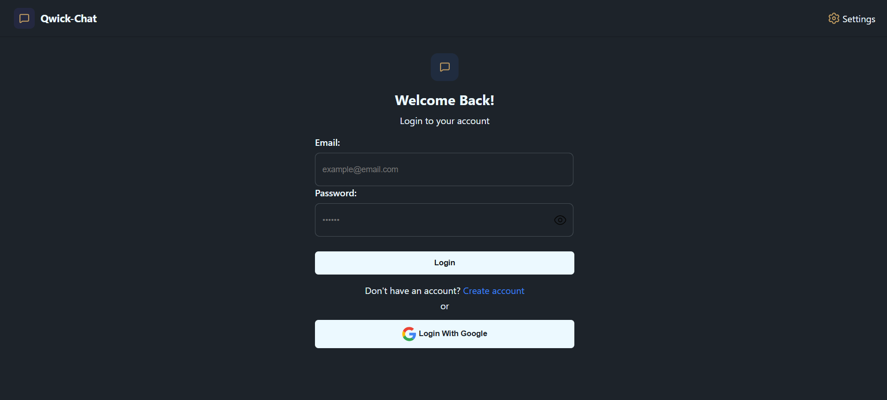
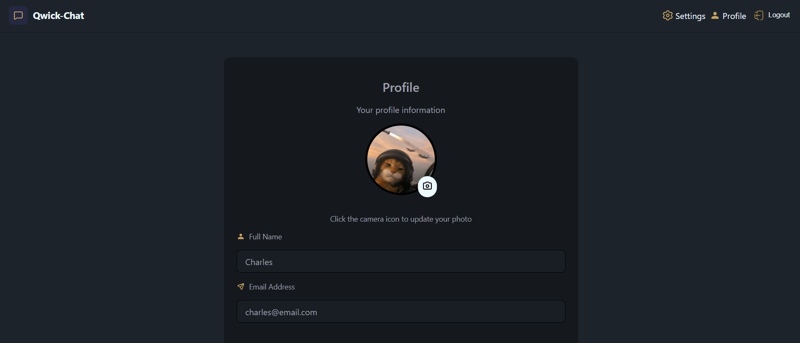
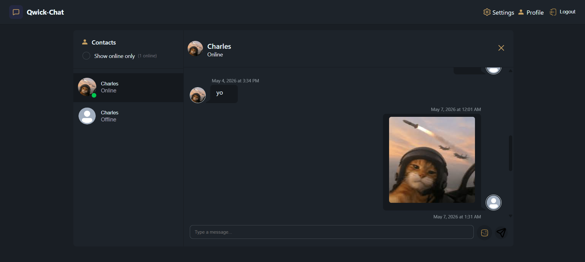
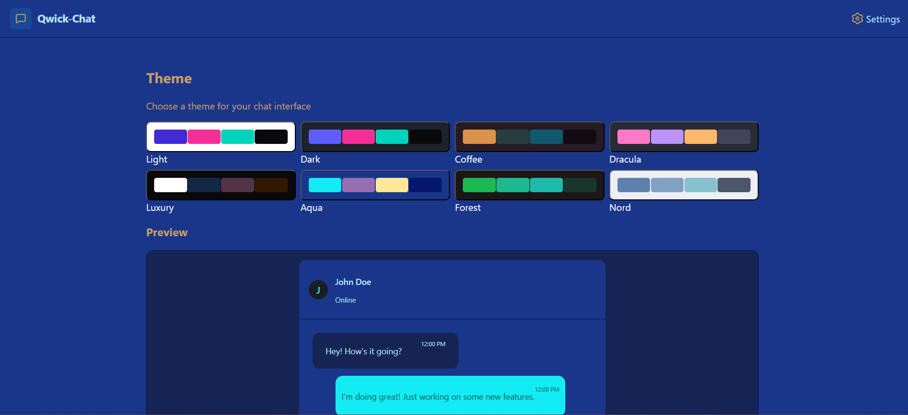

<a href='https://qwick-chat.com' target='_blank' style='font-size:26px; font-weight:500;'>Qwick-Chat</a>

A scalable full-stack chat application with a React/TypeScript frontend hosted on AWS S3 and delivered globally via CloudFront with HTTPS. The Node.js backend runs on EC2 instances behind an Application Load Balancer, while RDS MySQL ensures reliable data storage and Redis ElastiCache handles session management for high performance. Route 53 manages DNS and domain routing, enabling seamless, production-ready deployment.

Implements a session-based authentication system using Redis on ElastiCache, with Google OAuth 2.0 as an alternative login option and JWT tokens for secure authorization.

Enables image upload and storage using AWS S3, supporting both user profile pictures andchat-related media, ensuring scalable and secure handling of multimedia content.

A real time chat interface built using websockets for both live chatting and online status updates from your friends list.

Dynamic themes for user preference.
